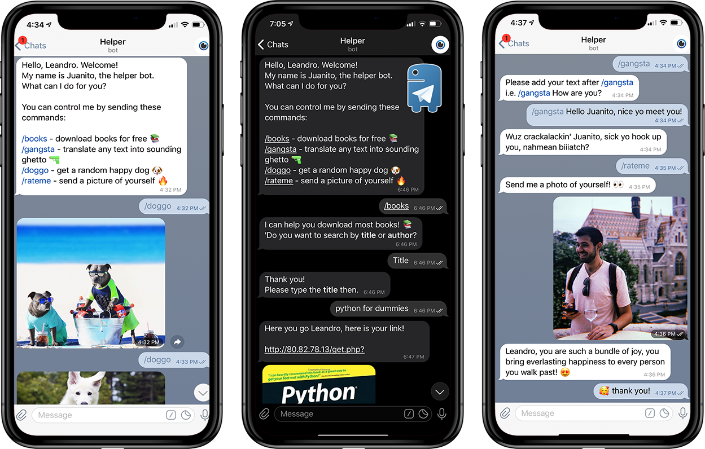

<!-- PROJECT SHIELDS -->
<!--
*** I'm using markdown "reference style" links for readability.
*** Reference links are enclosed in brackets [ ] instead of parentheses ( ).
*** See the bottom of this document for the declaration of the reference variables
*** for contributors-url, forks-url, etc. This is an optional, concise syntax you may use.
*** https://www.markdownguide.org/basic-syntax/#reference-style-links
-->
[![Contributors][contributors-shield]][contributors-url]
[![Forks][forks-shield]][forks-url]
[![Python Badge]][Python Badge]
[![MIT License][license-shield]][license-url]
[![LinkedIn][linkedin-shield]][linkedin-url]


<!-- PROJECT LOGO -->
<br />
<p align="center">
  <a href="images/logo.jpg">
    
  </a>

  <h3 align="center">TELEGRAM HELPER</h3>

  <p align="center">
    Telegram bot made to help me by automating daily tasks and processes.
    <br />
    <a href="https://https://github.com/lhandal/telegram-helper"><strong>Explore the docs »</strong></a>
    <br />
    <br />
    <a href="https://https://github.com/lhandal/telegram-helper">View Demo</a>
    ·
    <a href="https://https://github.com/lhandal/telegram-helper/issues">Report Bug</a>
    ·
    <a href="https://https://github.com/lhandal/telegram-helper/issues">Request Feature</a>
  </p>
</p>


<!-- TABLE OF CONTENTS -->
## Table of Contents

* [About the Project](#about-the-project)
  * [Built With](#built-with)
* [Getting Started](#getting-started)
  * [Prerequisites](#prerequisites)
  * [Installation](#installation)
* [Usage](#usage)
* [Roadmap](#roadmap)
* [Contributing](#contributing)
* [License](#license)
* [Contact](#contact)
* [Acknowledgements](#acknowledgements)


<!-- ABOUT THE PROJECT -->
## About The Project

<!-- PROJECT LOGO -->
<br />
<p align="center">
  <a href="images/probs.png">
    
  </a>
  </p>
</p>

This project started with the motivation of having a telegram assistant, in which I could program processes I did 
repeatedly. Later on it turned into a fun project to share with friends and help them too.
After successfully creating a Telegram bot that could:

* Reply to basic commands
* Send images and links
* Send static, hardcoded information

I decided to add more functionality for the bot to be able to:
* Maintain conversations (or threads) of a given topic
and change the desired outcomes depending on the last bit of information. 
* Use external APIs to tailor different responses better.

All the code is hosted in Heroku for ease of use and resilience.


### Built With

* [Python](https://www.python.org/)
* [Telegram](https://telegram.org/)
* [Heroku](https://www.heroku.com/)
* [Beautiful Soup](https://www.crummy.com/software/BeautifulSoup/bs4/doc/)


<!-- GETTING STARTED -->
## Getting Started

To get a local copy up and running follow these simple steps.

### Prerequisites

- Environment running python 3.6
- Telegram account
- Heroku account

### Installation
 
1. Clone the repo
    ```shell script
    $ git clone https://github.com/lhandal/telegram-helper.git
    ```
2. Install required packages
    ```shell script
    $ pip install -r requirements.txt
    ```

3. Create a blank Telegram bot with [BotFather](https://telegram.me/BotFather)

    This step is very simple to do, just go to the link above, talk to the botfather bot and follow the stps.
    More info and detailed steps in [this Medium article](https://medium.com/shibinco/create-a-telegram-bot-using-botfather-and-get-the-api-token-900ba00e0f39)

4. Copy the token provided by your new bot into the [credentials.py](credentials.py) script. 

5. Create a blank app in [Heroku](https://dashboard.heroku.com/new-app)

6. Deploy the app in Heroku
    ```shell script
    $ heroku login #login
    ```
    ```shell script
    $ git init
    $ heroku git:remote -a {heroku-project-name}
    ```
    ```shell script
    $ git add .
    $ git commit -m "Final Commit Deploying to Heroku"
    $ git push heroku master
    ```

    In my case I used GitHub CI/CD offered by heroku to redeploy the app with every commit to my repo.
    You can configure this inside the app preferences!


7. Go to the [kaffeine heroku](http://kaffeine.herokuapp.com/) app and paste the name of your app in there.
If you don't know, after 30 minutes of inactivity, Heroku puts your app to _sleep_ (idle) if you are using their free tier. Most of the times that is perfectly fine, since a request or ping will wake it up. Kaffeine pings your app every 25 minutes to avoid idleness.


<!-- USAGE EXAMPLES -->
## Usage

To use this bot click on this [LINK](https://telegram.me/le_helper_bot) or simply search for **@le_helper_bot**
in Telegram and press the **/start** command. After that you can start talking with my bot.


## Features

The implemented commands are:

- `/books` - helps you find and download books online in a guided conversation
- `/doggo` - sends you a different random pic of a happy dog every time
- `/gangsta` - converts anything you send into sounding ghetto
- `/rateme` - compliments/mocks you based on the picture you send 
- `/capitalize` - converts everything you send into capital letters 
(this can be used in outside convos as well, just type **@le_helper_bot** in other groups or conversations and the option pops up!)

<!-- ROADMAP -->
## Roadmap

See the [open issues](https://github.com/lhandal/telegram-helper/issues) for a list of proposed features (and known issues).

<!-- TODOS -->
## TODOs

* Implement a NLP model to be able to hold conversations better. 
* Implement more functions to include in outside conversations.
* Increase the number of input options for more robustness.
* Add any other functionalities to automate repeated processes.


<!-- CONTRIBUTING -->
## Contributing

Contributions are what make the open source community such an amazing place to be learn, inspire, and create. Any contributions you make are **greatly appreciated**.

1. Fork the Project
2. Create your Feature Branch (`git checkout -b feature/AmazingFeature`)
3. Commit your Changes (`git commit -m 'Add some AmazingFeature'`)
4. Push to the Branch (`git push origin feature/AmazingFeature`)
5. Open a Pull Request


<!-- LICENSE -->
## License

Distributed under the MIT License. See `LICENSE` for more information.


<!-- CONTACT -->
## Contact

Leandro Handal

- Email: [lhandalb@gmail.com](mailto:lhandalb@gmail.com)
- LinkedIn: [lhandal](https://linkedin.com/in/lhandal)
- Twitter: [@lhandalb](https://twitter.com/lhandalb)
- Instagram: [@lhandal](https://instagram.com/lhandal)

Project Link: [https://https://github.com/lhandal/telegram-helper](https://https://github.com/lhandal/telegram-helper)

<!-- MARKDOWN LINKS & IMAGES -->
<!-- https://www.markdownguide.org/basic-syntax/#reference-style-links -->
[contributors-shield]: https://img.shields.io/github/contributors/othneildrew/Best-README-Template.svg?style=flat-square
[contributors-url]: https://https://github.com/lhandal/telegram-helper/graphs/contributors
[forks-shield]: https://img.shields.io/github/forks/othneildrew/Best-README-Template.svg?style=flat-square
[forks-url]: https://https://github.com/lhandal/telegram-helper/network/members
[stars-shield]: https://img.shields.io/github/stars/othneildrew/Best-README-Template.svg?style=flat-square
[stars-url]: https://https://github.com/lhandal/telegram-helper/stargazers
[license-shield]: https://img.shields.io/github/license/othneildrew/Best-README-Template.svg?style=flat-square
[license-url]: https://https://github.com/lhandal/telegram-helper/blob/master/LICENSE.txt
[linkedin-shield]: https://img.shields.io/badge/-LinkedIn-black.svg?style=flat-square&logo=linkedin&colorB=555
[linkedin-url]: https://linkedin.com/in/lhandal
[product-screenshot]: images/screenshot.png
[Python Badge]:https://img.shields.io/badge/Made%20with-Python-blue
